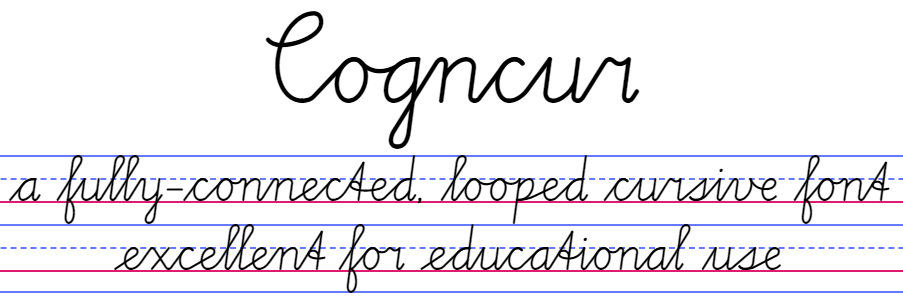
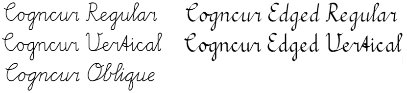
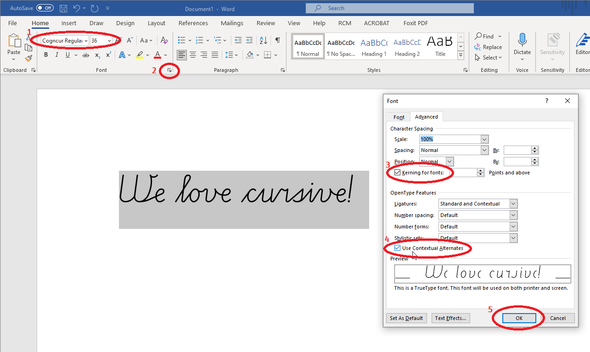

Cogncur is a high quality, fully connected cursive font for teaching purposes. 

# Download & install
The Cogncur font family contains multiple fonts:

Click on the links below to download these fonts:
* [Cogncur Regular](https://github.com/syboor/cogncur/raw/main/fonts/cogncur.ttf)
* [Cogncur Vertical](https://github.com/syboor/cogncur/raw/main/fonts/cogncurvertical.ttf)
* [Cogncur Oblique](https://github.com/syboor/cogncur/raw/main/fonts/cogncuroblique.ttf)

Double-click on the downloaded files and choose 'Install' to install them.
After installing the font, restart any applications in which you wish to use the font.

# Microsoft Word configuration
Cogncur uses OpenType features to form the connections between letters. In Microsoft Word, these features need to be enabled manually.

Follow the steps below to enable the required OpenType features in Microsoft Word:
1. Select some text and change the font to Cogncur. At this point, the letters will not be connected yet.
2. Open the Font dialogue by clicking on the button in the bottom right of the "Font" section of the ribbon, or by typing Ctrl+D. In the Font dialogue, open the 'Advanced' tab.
3. Check the option 'Kerning for fonts'; Microsoft Word will automatically add your current font size.
4. Check the option 'Use Contextual Alternates'.
5. After you click OK, the text in your document will update and the letters will be connected to each other.
   
These steps are demonstrated in this screenshot:

# Using Cogncur in other applications
* Many applications support OpenType and have relevant OpenType features enabled by default, for example: LibreOffice, Scrivener, Pages.
* In some applications, you'll need to enable OpenType features (especially contextual alternatives) manually, for example: Adobe Photoshop.
* Some applications support custom fonts but do not support OpenType, for example: Microsoft Powerpoint, Canva Pro. In those "legacy" applications, there is no feasible way to enter or edit cursive text from within the application. However, you can create your connected text in the ["Powerpoint converter" web application](https://cogncur.com/powerpoint) and then copy-paste this text into your legacy application.
* A lot of cloud applications don't allow you to use custom fonts, for example: Google Docs, Canva Free. It is not possible to use Cogncur in these applications.

# Create worksheets online
You can create handwriting worksheets in the online [Worksheet Creator](https://cogncur.com/worksheetcreator/). No font install is needed to use the worksheet creator. The worksheet creator is also an excellent way to discover all the - as of yet still undocumented - letter variants available in Cogncur.

# More documentation
...coming soon...
